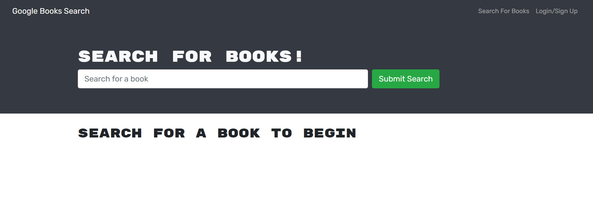

# MERN Stack Application - Book Search Engine

Bootcamp Module 21 Challenge - Building a MERN Stack Book Search Engine App

## Description

- This book search engine is developed as a MERN Stack application.
- Users can do simple book searches through the help of a google book API, but to save or to delete a book the user must be logged in.
- GraphQL is used as the querying language with Apollo Server to replace HTTP requests to access data.
- MongoDB Atlas is used as a cloud database solution for Heroku deployment.

## Table of content

- [Installation](#installation)
- [Usage](#usage)
- [Credits](#credits)
- [License](#license)

## Installation

- [Click here to go to the app](https://afternoon-reef-69229.herokuapp.com/)

## Usage

- [Link to the Github Repository](https://github.com/BranBao1995/Book-Search-Engine)

- This is the landing page, which is also where users can search for books:

  - 

- This is the UI after making a search, note that the option to save a book is not available because the user is not logged in:

  - 

- This is the login/signup modal:

  - 

- After authentication, a button to save a book becomes available for user for all book search results:

  - 

- After clicking on the "save this book" button, the button will become disabled and the text within the button will say "this book has already been saved":

  - 

- This is the Saved Books page where the logged in user can see all his saved books, the user can also delete a saved book:

  - 

## Credits

- Author's Github Profile: [https://github.com/BranBao1995](https://github.com/BranBao1995)

## License 

The MIT License

Copyright (c) [2022] [Hongdong Bao]

Permission is hereby granted, free of charge, to any person obtaining a copy
of this software and associated documentation files (the "Software"), to deal
in the Software without restriction, including without limitation the rights
to use, copy, modify, merge, publish, distribute, sublicense, and/or sell
copies of the Software, and to permit persons to whom the Software is
furnished to do so, subject to the following conditions:

The above copyright notice and this permission notice shall be included in all
copies or substantial portions of the Software.

THE SOFTWARE IS PROVIDED "AS IS", WITHOUT WARRANTY OF ANY KIND, EXPRESS OR
IMPLIED, INCLUDING BUT NOT LIMITED TO THE WARRANTIES OF MERCHANTABILITY,
FITNESS FOR A PARTICULAR PURPOSE AND NONINFRINGEMENT. IN NO EVENT SHALL THE
AUTHORS OR COPYRIGHT HOLDERS BE LIABLE FOR ANY CLAIM, DAMAGES OR OTHER
LIABILITY, WHETHER IN AN ACTION OF CONTRACT, TORT OR OTHERWISE, ARISING FROM,
OUT OF OR IN CONNECTION WITH THE SOFTWARE OR THE USE OR OTHER DEALINGS IN THE
SOFTWARE.
